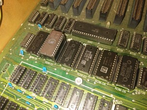
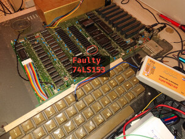
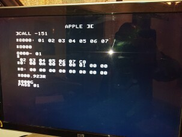
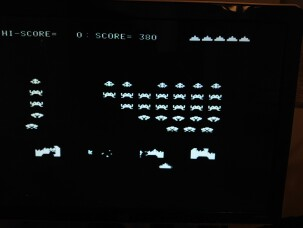

# Apple ][ revival

## Useful links

Some of these can be found in the docs folder

 - https://mirrors.apple2.org.za/Apple%20II%20Documentation%20Project/Books/W.%20Gayler%20-%20The%20Apple%20II%20Circuit%20Description.pdf (referred by AIICD in this doc) ([repo copy](docs/W.%20Gayler%20-%20The%20Apple%20II%20Circuit%20Description.pdf))
 - https://ia803001.us.archive.org/31/items/understanding_the_apple_ii/understanding_the_apple_ii.pdf (referred by UAII in this doc) ([repo copy](docs/understanding_the_apple_ii.pdf))
 - https://downloads.reactivemicro.com/Apple%20II%20Items/Hardware/II_&_II+/Schematic/ ([repo copy](docs/Apple%20II%20Schematics.pdf))
 - http://www.willegal.net/appleii/appleii-repair.htm

## Timeline

  - 2021-11-20: Wrote ROM section of this README, with socket adapter description
  - 2021-11-23: Created my 9136 socket adapter to dump current ROMs

[](pics/9316_adapt_1.jpg)
[](pics/9316_adapt_2.jpg)
[](pics/9316_adapt_3.jpg)

  - 2021-11-23: Dumped all the ROMs and compared it to binary found on the net. At first sight:

    - ROM D0 is OK
    - ROM D8 is OK
    - ROM E0 is OK
    - ROM E8 is OK
    - ROM F0 is KO
    - ROM F8 is OK

  - 2021-11-23: Retried reading F0 and every read attempt leads to a different bin. ROM chip is not consistent anymore, it's dead. It's a good lead !
  - 2021-11-24: Created my 2716 socket adapter to put EPROM on the Apple II motherboard

[](pics/2716_adapt.jpg)

  - 2021-11-24: Flashed the EPROM. As my TL866II didn't support 25V on VPP pin, I've had to use external power supply

[](pics/flash_eprom.jpg)

  - 2021-11-24: Inserted F0 EPROM with adapter on the motherboard, still no luck :(. Well it was necessary anyway as F0 chip was not consistent.

[](pics/eprom_mb.jpg)

  - 2021-11-24: Created a RAM test bench and tested many RAM chips

[](pics/ram_test_bench_1.jpg)
[](pics/ram_test_bench_2.jpg)

  - 2021-11-24: After testing OK 24 chips of RAM, installed them. It kinda started \o/

[](pics/boot_semiok.jpg)

  - 2021-11-24: From there I can go to monitor a check that my F0 EPROM chip is working OK

[](pics/monitor_f0.jpg)

  - 2021-11-24: But all is buggy (display is duplicated, sometimes boot doesn't happen). A way to reproduce a crash is to write to 0x820... I'll take a look why later
  - 2021-12-01: After trying to load data from cassette port via https://github.com/datajerk/c2t (that works btw !), I've seen that whenever we are writing to 0x1100, 0x1000 is overwritten with the same value
    
    - After multiple tries, I've managed to find that A8 pin from the 6502 is ignored when accessing the RAM, but not when accessing the ROM, so the problem lies in RAM address multiplexing
    - After reading RAM multiplexing (UAII p. 98 and AIICD p. 201), I've seen that the CPU A8 pin is used for the row of RA3 ram line. Corresponding column line for RA3 is A11. I've tested if A11 is ignored as well, and the answer is yes ! (e.g. 0x2446, 0x2546, 0x2C46 and 0x2D46 have the same value). I've got a problem with my RA3 line
    - Using a logic analyser, I've tested the output lines of the E11, E12 and E13 74LS153 multiplexor. As expected, output 9 of E11 (RA3) is down. With a continuity tester, I've validated that the RA3 line is correctly connected to the RAM chip, and yes it is (the motherboard is ok).
    - I've tried to exchange 2 E12 and E11 and behaviour changed. With the analyser, I've seen that the former E11 chip now in E12 still has nothing on the output 9. That is my problem, I've to replace this chip...
    - There is another 74LS153 on the Apple II motherboard, in C0. And it does not use its output 9... But when I swapped, nothing happened at all, maybe my faulty 74LS153 is more than faulty only on its output 9... Anyway, will try to order multiplexer to replace, I've very confident that this will greatly improves stability !

[](pics/debugging_ram.jpg)

  - 2021-12-03: As expected, after replacing 74LS153 chip in E11, everything is fine ! I've put all tested RAM chips to have 48ko on the Apple II and ran the memtester in asm. Binary code was transfered over cassette port via `c2t` software. I've also tested Apple Invaders it works as well !


[](pics/ramtest_ok.jpg)
[](pics/apple_invaders.jpg)


## ROM

 - Current ROM chip : 9316 ([datasheet](docs/ROM9316.pdf))
 - Semi-compatibles: EPROM 2716 and EEPROM 28C16 ([datasheet](docs/2716.pdf))

9316 and 2716 compatibles on all pins except:
 - 18: CS2 on 9316 | /EP on 2716
 - 20: CS1 on 9316 | /G  on 2716
 - 21: CS3 on 9316 | Vpp on 2716

On Apple II, the Chip Select combination of all ROM chips is 010. CS1 (20) and CS3 (21) should be LOW and CS2 (18) should be up on one ROM chip to be enabled. (UAII p. 136)

On 2716, read is done when /EP (pin 18) and /G (pin 20) are LOW, inhibition is when /G (pin 20) is HIGH or standby when /EP is HIGH (like inhibition but consume less power but ). Vpp (pin 21) shoud be always HIGH (and can also be 25V if programming mode).
28C16 EEPROM is fully compatible with 2716.

### Dumps

Using socket adapter described below, I've dumped all the ROM chips present in the Apple ][ to validate them against
binary Apple II ROM image. Dumps are located in `dumprom/` folder.

### Socket adapter

With those info we can create our socket adapter.

What need to be considered:
_(In this list, xyz state corespond to pin 18/20/21 state)_

 - Data/adress/voltage pin are ok
 - Pin 21 may received 25V if TL866II is in programmer mode, and thus may destroy the 9316 chip
 - (With a 9316 on TL866II)  In read mode, TL866II will send 001 but 9316 chip expect 100 -> KO
 - (With a 2716 on Apple II) In read mode, Apple II will send 100 but 2716 expect 001 -> KO
 - (With a 2716 on Apple II) In deselect mode, Apple II will send 111 and 2716 expect \*11 to be deselected -> OK
 - (With a 2716 on Apple II) In inhibit mode, Apple II may send 000 but 2716 expect \*11 or 1\*1 to be deselected -> KO
 - The good news is, pin 20 is ok in all mode

So, to make a 9316 on TL866II adapter:
 - In this mode, we will force CS as the correct value, except pin 20 that is correct (we will have deselect support, even if this is not really important)
 - Cut pin 21 and connect dangling port to expected state (LOW, ie port 12)
 - Cut pin 18 and connect dangling port to expected state (HIGH, i.e. port 24)

And to make a 2716 on Apple II adapter:
 - Pin 21 can be forced to high (not doing so will put 2716 in unexpected state)
 - The good news is, pin 20 is ok for all cases
 - Pin 18 should in fact be reversed, this can be done with a NC7S04 (cf. http://www.willegal.net/appleii/appleii-integer.htm)
 - Another solution is to force pin 18 value to pin 20 BUT inhibition won't work (i.e. no language card support)
 - Cut pin 21 and connect dangling port to expected state (HIGH, ie port 24)
 - Cut pin 18 and connect dangling port to port 20

### TL866II+

Minipro is the way to go:
```
yay -S minipro
```

Reading:
```
minipro -p M2716@DIP24 -r out.bin
```

Writing:
```
minipro -p M2716@DIP24 -w GOODF0.bin
```

### References

 - UAII (chapter 6, p. 149 for socket adapter)
 - http://www.willegal.net/appleii/appleii-integer.htm
 - 9316 -> 2716 mapping (i.e. to read Apple II rom on TL866II) :  https://www.mikesarcade.com/cgi-bin/spies.cgi?action=url&type=info&page=9316.txt

## RAM

RAM chip on the Apple II are 4116 ([datasheet](docs/4116.pdf)). Each chip stores 16 kibits, i.e. 2 kibytes per chip. On the motherboard there is 3 rows of 8 chip socket (16 kibytes per row, maximum 48 kibytes for all the Apple II).

Inside the chip, the memory is viewed as an array of 128\*128\*1bit, i.e. 2\*\*7=128 rows, 2\*\*7=128 columns, and each row/column correspond to a bit.

On the chip, we have 7 pin for the address (that is the row or column id), RAS and CAS pin that will tell if the address pins are used to set column or row id, a R/W pin and data IN and OUT pins (as we store bit only 1 data pin for each direction). And for more fun, 4 power pin, 5V, 12V, -5V and GND...

### RAM tester

With that in mind we can easily write a RAM chip tester with an arduino. The tester will write random data to each address and try to read it afterwards.

A problem that may appears is to have power source for +5V, +12V and -5V. As it is designed for this, we can use the Apple II power supply.

RAM test code is available in `ramtester/` folder.
